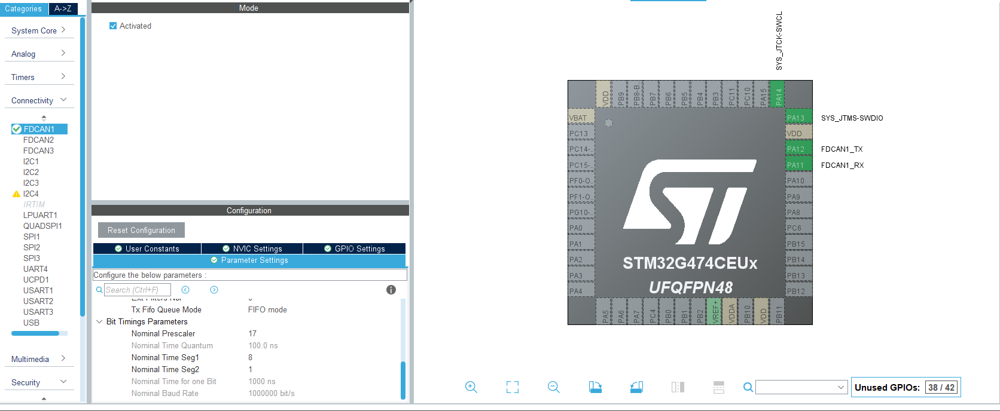

# STM32 BMS Library for Jawin 30000mAh 18S Battery

<span style="font-size:smaller;">
  This library allows an STM32 microcontroller to interface with a <strong>Jawin 30000mAh 18S smart battery</strong> over <strong>CAN bus (1 Mbps)</strong>. It reads and decodes battery metrics such as voltage, current, temperature, SOC (state of charge), and per-cell voltages. This example is tested with stm32 g474 can node so i use FDCAN as CAN2.0B for receiving data.
</span>

## Table of Contents
- [File Structure](#file-structure)
- [Features](#features)
- [Hardware Setup](#hardware-setup)
- [Battery Information](#battery-information)
- [CAN Data Frame Format & Decoding](#can-data-frame-format--decoding)


---
## File Structure

  | File      | Description                          |
  |-----------|--------------------------------------|
  | `bms.h`   | Header file with API functions       |
  | `bms.c`   | Source file with CAN parsing logic   |

---
## How to Use This Library

  1. **Enable FDCAN** in STM32CubeMX (1 Mbps)
  2. **Copy `bms.h` and `bms.c`** into your project
  3. **Initialize and start** FDCAN in `main.c`
  4. Call `BMS_Update()` regularly inside your main loop
  5. Use the getter functions to access live battery data

### API Example

```c
BMS_Update(&hfdcan1);                    // Update internal battery data from CAN frame

uint16_t cell0_voltage = BMS_GetBatteryCell(0);    // Get voltage of cell 0
uint16_t cell_count = BMS_GetNoOfCell();           // Get number of cells
uint16_t temperature = BMS_GetTemp();              // Get battery temperature
uint16_t soc = BMS_GetBatteryPercentage();         // Get state of charge (%)
uint16_t pack_voltage = BMS_GetSumVoltage();       // Get total pack voltage
int32_t pack_current = BMS_GetCurrent();           // Get battery current
```

---
## Features

- ✅ Compatible with **Jawin 18S CAN battery**
- ⚡ Reads:
  - Total voltage
  - Battery current (signed)
  - Battery temperature
  - State of charge (percentage)
  - Per-cell voltages (up to 18 cells)
- 🧠 Automatically decodes known CAN message IDs
- ⏱️ Tracks last update timestamp via `last_update_ms`

---

## Hardware setup

- **MCU**: STM32 with FDCAN peripheral (e.g., STM32G4)
- **Wiring**:
  - CAN High and Low connected to STM32 CAN transceiver
  - Optional 120Ω termination resistor at each CAN end
  - Shared ground between battery and STM32

---

## STM32CubeMX IOC Example

Below is a screenshot of the FDCAN configuration in STM32CubeMX for reference:



*Make sure your settings match the screenshot for correct CAN communication.*

---

## Battery information

- **Name**: Jawin 30000mAh 18S smart battery 
- **Protocol**: CAN2.0B
- **CAN Speed**: **1 Mbps**
- **Wiring**:
  - 4AWG Red Wire: VBAT
  - 4AWG Black Wire: GND
  - 26AWG Red Wire: 5V (BUS Logic)
  - 26AWG Black Wire: GND
  - 26AWG Blue Wire: CANH
  - 26AWG White Wire: CANL

---

##  CAN Data Frame Format & Decoding

Each CAN message from the battery includes:

- **29-bit CAN ID** to identify message type
- **8-byte data frame** with specific structure depending on ID
- **CAN Speed**: 1Mbps
- **Message Type**: Little Endian

|   CAN ID    |            1st byte            |             2nd byte            |                 3th byte                  |                  4th byte                  |            5th byte            |            6th byte             |          7th byte         |            8th byte            |
|-------------|--------------------------------|---------------------------------|-------------------------------------------|--------------------------------------------|--------------------------------|---------------------------------|---------------------------|--------------------------------|
| 0x002E0951  | Unknown Low Byte               | Unknown High Byte               | Voltage of Battery Low Byte               | Voltage of Battery High Byte               | Current Low Byte               | Current High Byte               | Unknow Low Byte           | Unknown High Byte           |
| 0x002E0942  | Battery Temperature Low Byte   | Battery Temperature High Byte   | Always 0x04                               | Always 0x01                                | Battery Percentage Low byte    | Battery Percentage High Byte    | Always 0                  | Always 0                    |
| 0x002E0943  | Always 0                       | Always 0                        | Amount of cell in battery (18s) Low byte  | Amount of cell in battery (18s) High byte  | 1st Cell Voltage Low Byte      | 1st Cell Voltage High Byte      | 2nd Cell Voltage Low Byte | 2nd Cell Voltage High Byte  |
| 0x002E0944  | 3rd Cell Voltage Low Byte      | 3rd Cell Voltage High Byte      | 4th Cell Voltage High Byte                | 4th Cell Voltage High Byte                 | 5th Cell Voltage Low Byte      | 5th Cell Voltage High Byte      | 6th Cell Voltage Low Byte | 6th Cell Voltage High Byte  |
| 0x002E0945  | 7th Cell Voltage Low Byte      | 7th Cell Voltage High Byte      | 8th Cell Voltage High Byte                | 8th Cell Voltage High Byte                 | 9th Cell Voltage Low Byte      | 9th Cell Voltage High Byte      | 10th Cell Voltage Low Byte | 10th Cell Voltage High Byte  |
| 0x002E0946  | 11th Cell Voltage Low Byte     | 11th Cell Voltage High Byte     | 12th Cell Voltage Low Byte                | 12th Cell Voltage High Byte                | 13th Cell Voltage Low Byte     | 13th Cell Voltage High Byte     | 14th Cell Voltage Low Byte | 14th Cell Voltage High Byte  |
| 0x002E094F  | 15th Cell Voltage Low Byte     | 15th Cell Voltage High Byte     | 16th Cell Voltage Low Byte                | 16th Cell Voltage High Byte                | 17th Cell Voltage Low Byte     | 17th Cell Voltage High Byte     | 18th Cell Voltage Low Byte | 18th Cell Voltage High Byte  |


###  **Remarks**

- **Voltage of Battery** values are raw `uint16_t`:
  - Divide by **100** to get actual **volts (V)**
    
- **Current** is a **signed** value:  
  - Positive → battery is **charging**  
  - Negative → battery is **discharging**
  - Divide by **1000** to get actual **Ampere (A)**

- **Temperature** values are raw `uint16_t`:
  - Divide by **100** to get actual **celsius (C)**

- **Battery Percentage** values are raw `uint16_t`:
  - Divide by **100** to get actual **percent (%)**
  
- **Cell Voltage** values are raw `uint16_t`:
  - Divide by **1000** to get actual **volts (V)**


  ---


